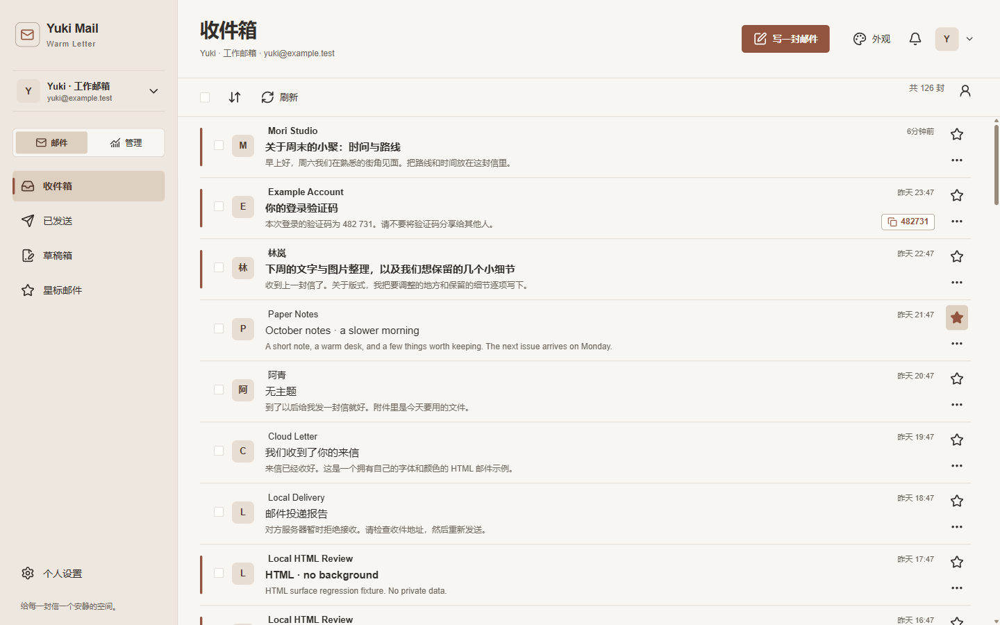
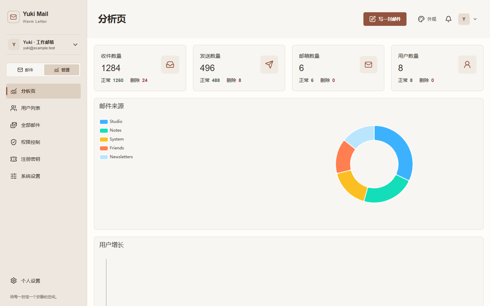
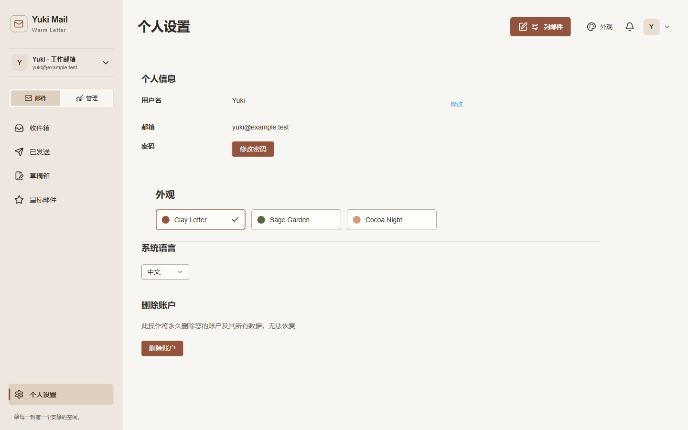
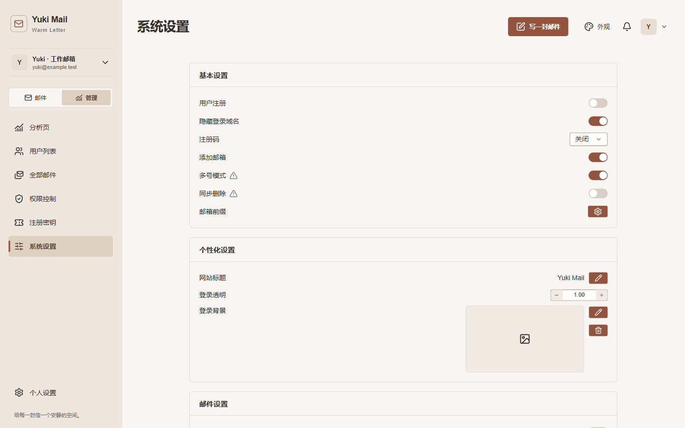
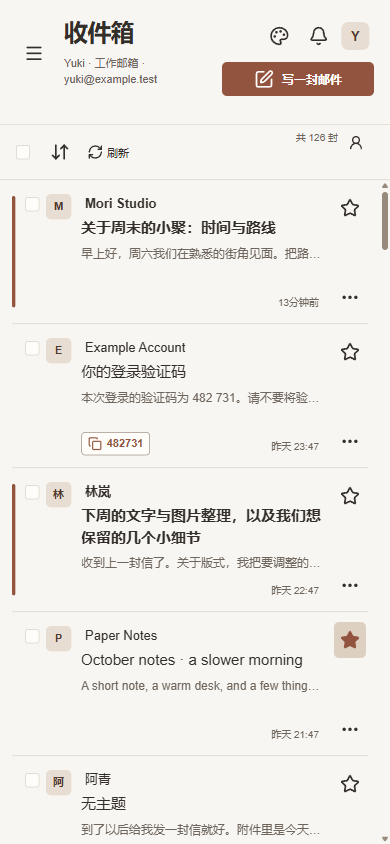

<div align="center">

# Yuki Mail

*A quiet place for your letters.*

A warm, lightweight, and personal little place for email.

[Open Yuki Mail](https://mail.jcllyuki.com) · [Contact YUKI](mailto:jclllycf@gmail.com)

</div>

## Product showcase

Every image below is captured from the **real Yuki Mail frontend** with a local isolated fixture API. Names, addresses, messages, verification codes and analytics are fictional; no production mailbox data is used.

| Inbox | Analytics |
|:--|:--|
|  |  |

| Personal settings | System settings |
|:--|:--|
|  |  |

<p align="center">
  
</p>

## Warm Letter UI

Yuki Mail keeps Cloud Mail's full mail workflow while adding a calmer product language for everyday use:

- **Clay Letter** — warm paper and clay; the default.
- **Sage Garden** — ivory surfaces with muted sage.
- **Cocoa Night** — warm charcoal, cream text and muted copper.
- A unified local SVG icon family, visible keyboard focus, responsive layouts and soft product motion.
- Refined Inbox, Reader, Compose, account switcher, dialogs, settings and admin surfaces.
- Unstyled HTML mail inherits the active theme while explicit sender formatting remains intact.

## Features

- Serverless mail service on Cloudflare Workers.
- Multiple addresses, inbox, sent mail, drafts, starred mail and admin workspace.
- Rich-text sending, attachments and delivery state through Resend / Cloudflare Email.
- R2 attachment storage, D1 database and KV.
- RBAC, users, roles, invite codes and system administration.
- Workers AI verification-code recognition.
- ECharts analytics and growth visualizations.
- Turnstile, forwarding, webhooks and upstream OAuth capabilities.

## AI Agent & MCP

Yuki Mail can also act as MCP-native mail infrastructure for AI agents. The current server exposes 8 tools:

**Read tools:** `cloud_mail_list`, `cloud_mail_search`, `cloud_mail_get`, `cloud_mail_get_verification_code`, `cloud_mail_get_attachment`.

**Guarded write tools:** `cloud_mail_send`, `cloud_mail_delete`, `cloud_mail_create_mailbox`.

Safety modes:
- `readonly` — hard-block all writes locally.
- `ask` — recommended default; reads run automatically and writes require MCP-host approval.
- `full` — execute writes directly.

See [MCP Setup & Integration Guide](docs/MCP_SETUP_GUIDE.md).

## Tech stack

- **Platform:** Cloudflare Workers
- **Backend:** Hono + Drizzle
- **Frontend:** Vue 3 + Vite + Element Plus
- **Mail:** Resend / Cloudflare Email
- **Data:** Cloudflare D1 + KV
- **Storage:** Cloudflare R2
- **Charts:** ECharts
- **Agent integration:** Model Context Protocol (MCP)

## Structure

```text
cloud-mail-yuki/
├─ mail-worker/
├─ mail-vue/
├─ packages/mcp-server/
├─ docs/
└─ showcase/      # local fixture + screenshots from the real frontend
```

## Development & deployment

The Vue frontend lives in `mail-vue/`; the Cloudflare Worker lives in `mail-worker/`. Deployment continues to use the existing Wrangler / Cloudflare workflow.

Never commit `.env`, API tokens, Cloudflare secrets or real mailbox data. The showcase fixture listens only on loopback and is used solely to render privacy-safe documentation captures.

## About

Designed & maintained by **YUKI**

- Version: shown in System Settings → About
- Website: [mail.jcllyuki.com](https://mail.jcllyuki.com)
- Contact: [jclllycf@gmail.com](mailto:jclllycf@gmail.com)
- Support / Feedback: [GitHub Issues](https://github.com/jclllycf/cloud-mail-yuki/issues)

## Open-source acknowledgements

Yuki Mail is based on [Cloud Mail by maillab](https://github.com/maillab/cloud-mail). The upstream copyright notice and MIT License remain in [LICENSE](LICENSE).

The upstream usage note is retained as secondary context: for learning and exchange only; unlawful use is prohibited. Please comply with local law.

## License

MIT — see [LICENSE](LICENSE).
