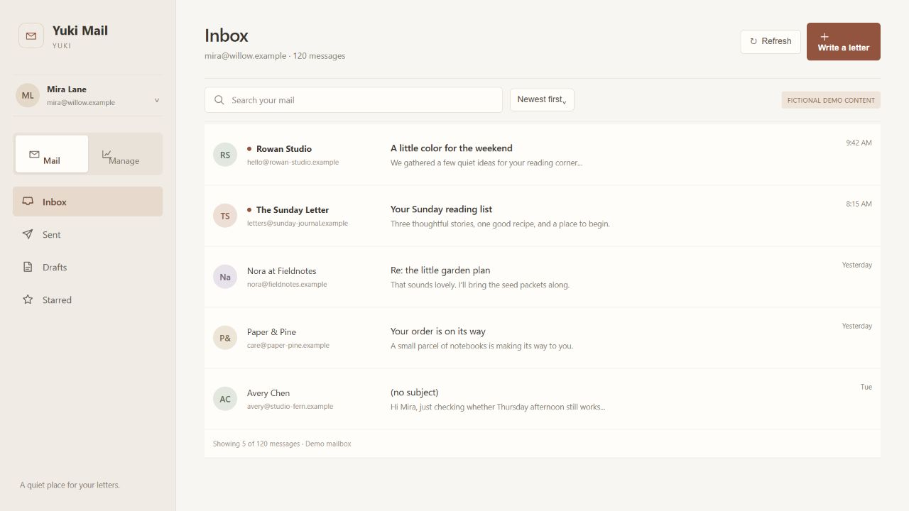
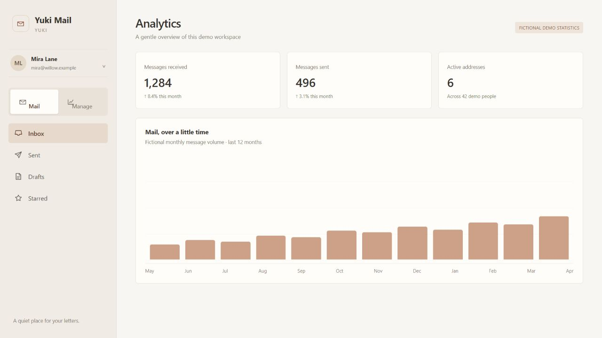
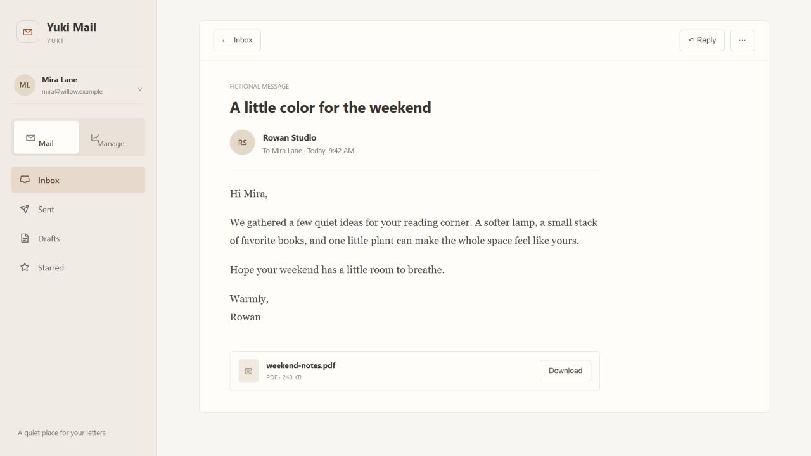
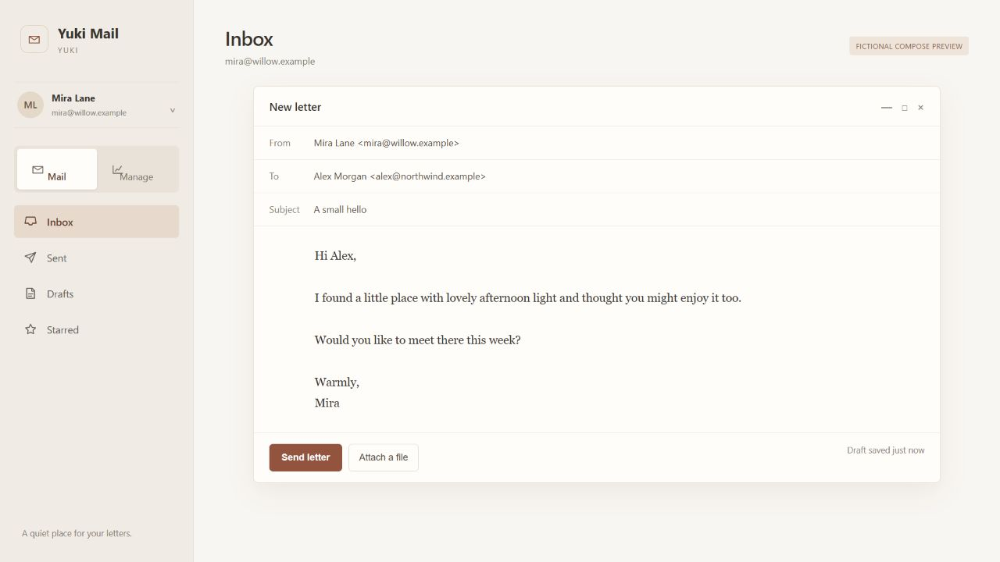
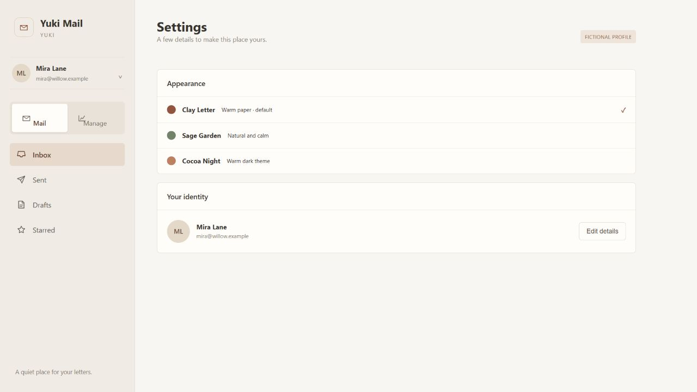
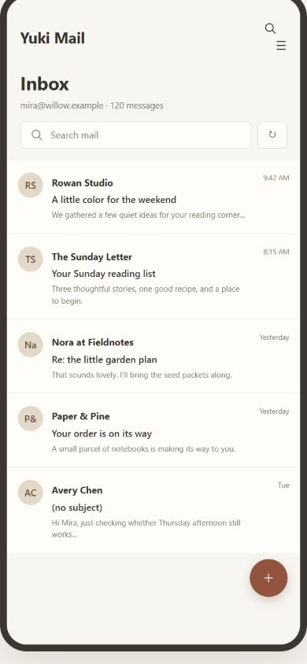

# Yuki Mail

*A quiet place for your letters.*

Yuki Mail is a warm, lightweight, and personal webmail experience built around clarity, comfort, and everyday use.

[Open Yuki Mail](https://mail.jcllyuki.com) · [Contact](mailto:jclllycf@gmail.com)

## Three appearances

- **Clay Letter** — warm paper and clay; the default.
- **Sage Garden** — ivory and natural sage.
- **Cocoa Night** — warm charcoal, cream, and muted copper.

## Product showcase

All names, mail, addresses, and analytics in these images are fictional demo content. No live mailbox data is shown.

| Inbox | Analytics |
|:--|:--|
|  |  |

| Reader | Compose |
|:--|:--|
|  |  |

| Settings and themes | Mobile inbox |
|:--|:--|
|  |  |

## About

**Yuki Mail** is a warm, lightweight, and personal little place for email. Designed to make everyday mail feel a little quieter, simpler, and more personal.

Designed & maintained by **YUKI**

- Website: [mail.jcllyuki.com](https://mail.jcllyuki.com)
- Contact: [jclllycf@gmail.com](mailto:jclllycf@gmail.com)

## Open-source acknowledgements

Based on [Cloud Mail by maillab](https://github.com/maillab/cloud-mail). The upstream MIT License and copyright notice remain in [`LICENSE`](LICENSE).

The upstream project’s use note is retained as secondary context, separate from the Yuki Mail welcome: “For learning and exchange only; use for unlawful business is prohibited. Please comply with local laws. The original author accepts no legal liability.”

## Development

The Vue 3 + Vite frontend is in `mail-vue/`; the Cloudflare Worker is in `mail-worker/`. Showcase materials under `showcase/` are documentation-only and are not bundled into the production frontend.

## License

MIT. See [`LICENSE`](LICENSE).
